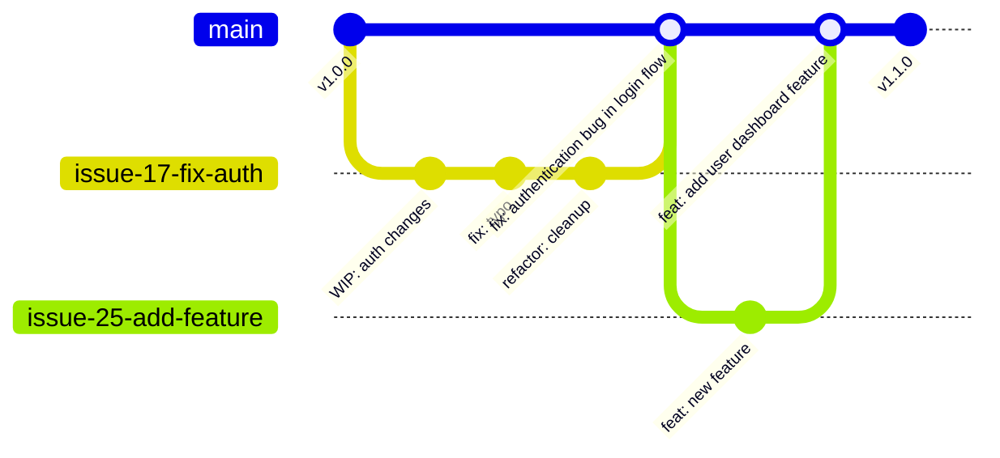

# Contributing Guidelines

We follow a **simplified GitHub Flow** with **rebase and merge** strategy for clean commit history and milestone-driven releases.

## 📋 Quick Start

- [Workflow Overview](#workflow-overview)
- [Issue and Milestone Management](#issue-and-milestone-management)
- [Development Process](#development-process)
- [Commit Management](#commit-management)
- [Pull Request Process](#pull-request-process)
- [Release Management](#release-management)
- [Code Standards](#code-standards)

## 🔄 Workflow Overview

Our workflow emphasizes **clean commit history** and **milestone-driven releases**:



### Key Principles
- **One clean commit per issue** when merged to main
- **Rebase and merge only** - no merge commits
- **Milestone-driven releases** - all issues must belong to a milestone
- **Draft PRs for early collaboration** with reviewers

## 📊 Issue and Milestone Management

### Creating Issues
All work must begin with a GitHub Issue:

1. **Select milestone first** - Choose from available milestones
2. **Use issue templates** - Bug Report or Feature Request
3. **Fill out completely** - All template fields are required

#### Issue Types and Commit Prefixes:
| Issue Type      | Commit Prefix | Version Impact | Example                                 |
| --------------- | ------------- | -------------- | --------------------------------------- |
| Bug Report      | `fix:`        | Patch          | `fix: resolve payment gateway timeout`  |
| Feature Request | `feat:`       | Minor          | `feat: add user profile management`     |
| Documentation   | `docs:`       | None*          | `docs: update API authentication guide` |
| Refactoring     | `refactor:`   | None*          | `refactor: optimize database queries`   |
| Maintenance     | `chore:`      | None*          | `chore: update dependencies to latest`  |

*\*Does not trigger version bumps by release-please*

### Milestone Management
- **All issues must have a milestone** assigned before starting work
- **Milestones represent releases** - e.g., v1.1.0, v1.2.0
- **Release when milestone complete** - all issues closed
- **Version numbers follow semantic versioning**

## 🚀 Development Process

### 1. Create Issue Branch
1. Navigate to your assigned GitHub Issue
2. Click "Create a branch for this issue"
3. **Source**: Always branch from `main`
4. **Naming**: GitHub auto-generates (e.g., `17-fix-payment-gateway`)

### 2. Start with Draft PR (Recommended)
Create a **Draft PR** immediately for early collaboration:

```bash
# After first commit
git push -u origin <branch-name>
# Create Draft PR on GitHub
```

**Benefits of Draft PRs:**
- Early feedback from CODEOWNERS reviewers
- Discuss approach before implementation
- Avoid large changes at review time
- Track progress transparently

### 3. Development and Commits
During development, commit frequently with descriptive messages:

```bash
# Examples of work-in-progress commits
git commit -m "WIP: initial authentication setup"
git commit -m "add password validation logic"
git commit -m "fix: handle edge case for empty passwords"
git commit -m "refactor: extract validation functions"
git commit -m "docs: add authentication flow diagram"
```

## 📝 Commit Management

### Before Requesting Review
**Always clean up your commit history** using interactive rebase:

```bash
# Rebase and squash commits
git rebase -i main

# Example: Squash multiple commits into one clean commit
# Before:
# fix: initial auth setup
# refactor: cleanup code
# fix: handle edge cases
# docs: add comments

# After:
# fix: resolve authentication timeout issues
```

### Final Commit Requirements
Your **first commit** must follow release-please requirements:

- **Use conventional commit format**: `<type>: <description>`
- **Must be `feat:` or `fix:`** to trigger version updates
- **PR title must match first commit message**
- **Keep additional commits for reviewer context** (if any)

#### Good Examples:
```bash
feat: add user dashboard with activity metrics
fix: resolve payment gateway connection timeout
refactor: optimize database query performance
```

#### Bad Examples:
```bash
WIP: working on dashboard  # ❌ Not conventional format
Update code  # ❌ Not descriptive
feat add dashboard  # ❌ Missing colon
```

## 🔀 Pull Request Process

### Before Creating/Converting PR

1. **Sync with main branch**:
```bash
git fetch origin
git rebase origin/main
git push --force-with-lease origin <branch-name>
```

2. **Clean up commits** using interactive rebase
3. **Run all tests and linting** locally

### Creating the PR

Use our **PR template** which includes:

- **Issue reference**: Automatically linked via branch name
- **Change description**: What was implemented
- **Testing checklist**: Manual and automated tests
- **Reviewer checklist**: For CODEOWNERS review

#### PR Title Format:
```
<type>: <description>
```
**Must match your first commit message exactly**.

### Review Process

1. **CODEOWNERS automatically assigned** as reviewers
2. **Address feedback with additional commits** (don't squash during review)
3. **All CI checks must pass** before merge
4. **At least one approval required** from CODEOWNERS

### Merge Process

- **Only "Rebase and merge" allowed** - other options are disabled
- **Maintainer performs the merge** after approval
- **Branch automatically deleted** after merge

## 🏷️ Release Management

### Milestone Completion
When all issues in a milestone are completed:

1. **Release-please creates release PR** automatically
2. **Maintainer reviews and merges** release PR to main
3. **Automatic version bump and changelog** generation
4. **Git tag created** with version number
5. **CI/CD deployment triggered** automatically

### Version Strategy
Following **semantic versioning** (semver):

- **feat:** commits → Minor version bump (1.1.0 → 1.2.0)
- **fix:** commits → Patch version bump (1.1.0 → 1.1.1)
- **BREAKING CHANGE:** → Major version bump (1.1.0 → 2.0.0)

## 💡 Code Standards

### Quality Requirements
- **All linting warnings resolved** before review
- **Test coverage ≥ 80%** for new code
- **Unit tests required** for business logic
- **Integration tests required** for APIs

### Naming Conventions
- **Variables**: camelCase (JS/Dart) or snake_case (Python)
- **Functions**: Descriptive verbs (`getUserById`, `calculateTotal`)
- **Classes**: PascalCase (`UserService`, `PaymentGateway`)
- **Files**: kebab-case (`user-service.js`, `payment-gateway.py`)

### Best Practices
- **Functions under 20 lines** (max 50 lines)
- **Single responsibility principle**
- **Maximum 3 levels of nesting**
- **Meaningful comments explain why, not what**
- **Remove dead code** before PR

## 🛠️ Common Git Operations

### Interactive Rebase Example
```bash
# Start interactive rebase
git rebase -i main

# In the editor, change 'pick' to 'squash' or 's' for commits to combine
pick abc1234 feat: add user authentication
squash def5678 fix: handle edge cases
squash ghi9012 refactor: cleanup validation logic

# Result: One clean commit with all changes
```

### Handling Review Changes
```bash
# Make changes based on review feedback
git add .
git commit -m "address review feedback: improve error handling"

# Push changes (PR updates automatically)
git push origin <branch-name>
```

## 🤔 FAQ

**Q: Should I squash commits during code review?**
A: No! Keep review changes as separate commits. Only clean up before initial review request.

**Q: What if I need to update my branch during review?**
A: Rebase on main if needed, but don't squash review feedback commits until after approval.

**Q: Can I work on multiple issues simultaneously?**
A: Yes, but each must have its own branch and milestone assignment.

**Q: What happens if CI fails after merge?**
A: Create a hotfix issue and follow the same process. No direct commits to main allowed.

**Q: How do I handle breaking changes?**
A: Include "BREAKING CHANGE:" in commit footer to trigger major version bump.

---

**Remember**: Clean history on main, detailed history during development! 🧹✨