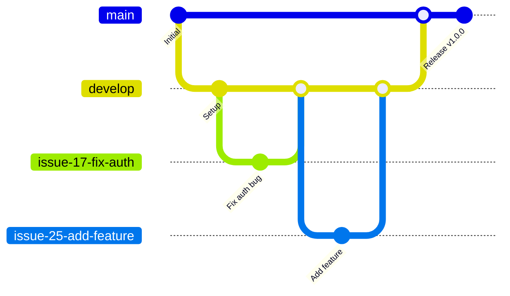
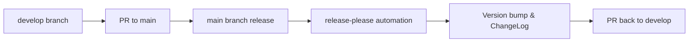

# Contributing Guidelines

We follow a **GitHub Projects-driven workflow** that combines issue tracking with visual project management for better team coordination and automated status tracking.

## 📋 Quick Start

- [Project Board Workflow](#project-board-workflow)
- [Branching Strategy](#branching-strategy)
- [Development Workflow](#development-workflow)
- [Pull Request Process](#pull-request-process)
- [Branch Protection](#branch-protection)
- [Code Standards](#code-standards)

## 📊 Project Board Workflow

We use **GitHub Projects Sprint Board** for visual project management and automated workflow tracking.

### Sprint Board Columns
- **Backlog** – New issues waiting for planning
- **Ready** – Issues planned and ready to start
- **In Progress** – Currently being worked on
    - *Note: Creating a pull request (PR) is still considered part of the In Progress stage. Developers are responsible for actively seeking reviewers and initiating the review process.*
- **In Review** – Pull request is under review and either:
    - A reviewer has requested changes, or
    - The pull request has been approved by some reviewers (but not all required approvals have been received)
- **Done** – Completed and merged to develop

## 🌿 Branching Strategy

We follow a simplified **Issue-Driven Git Flow** for branch management:



### Main Branches
- **`main`** - Production branch (stable, released code)
  - **Purpose**: Production/release branch
  - **Access**: Only accepts PRs from `develop` branch
  - **Developer restrictions**: No direct modifications allowed
  - **Release management**: Managed by release-please automation
- **`develop`** - Integration branch (latest features for next release)
  - **Purpose**: Integration branch for next release
  - **Access**: Accepts PRs from issue branches only
  - **Version updates**: Receives version and ChangeLog updates from `main` after releases


Both branches are **PR-only** with strict protection:

- **No direct commits** - All changes must come through Pull Requests
- **No force push** - History cannot be rewritten
- **Forward-only** - If issues arise, create new PRs to fix them




### Issue-Based Branches
All development work uses issue-based branches:
- **Created via**: GitHub's issue branch creation feature only
- **Naming**: Auto-generated by GitHub (e.g., `17-fix-payment-gateway`, `25-add-user-auth`)
- **Branch from**: Always `develop` for regular development
- **Merge back to**: `develop` for all regular development work

## 🔄 Development Workflow

### 1. Create an Issue
All work must begin with a GitHub Issue using our predefined templates:

- **Feature Request** - For new features or enhancements
- **Bug Report** - For bug fixes and issues

Select the appropriate template and fill out the form completely. The template will automatically generate a standardized issue description.

#### Feature Request Flow:
1. **Create Issue** → Use Feature Request template
2. **Add to Sprint Board** → Move to "In Progress"
3. **Create Issue Branch** → From `develop` branch
4. **Commit Messages** → Use `feat:` prefix
5. **Create PR** → Target `develop` branch, Use `close: #<Issue ID> <description>`
6. **After Merge** → Automatically added to ChangeLog under "Features"

#### Bug Report Flow:
1. **Create Issue** → Use Bug Report template
2. **Add to Sprint Board** → Move to "In Progress"
3. **Create Issue Branch** → From `develop` branch
4. **Commit Messages** → Use `fix:` prefix
5. **Create PR** → Target `develop` branch, Use `close: #<Issue ID> <description>`
6. **After Merge** → Automatically added to ChangeLog under "Bug Fixes"

### 2. Add Issue to Sprint Board
**Before starting any work**, add the issue to the Sprint Board and fill in the planning fields:

#### Required Fields:
```
□ Priority: High/Medium/Low
□ Estimate: Expected effort in story points
□ Iteration: Target sprint/milestone
□ Start Date: When you plan to begin work
□ Assignee: Assign to yourself
```

#### Story Point Reference:
| Story Points | Duration  | Description                       |
| ------------ | --------- | --------------------------------- |
| 1            | 1-2 hours | Very simple fix                   |
| 2            | Half day  | Simple feature/bug fix            |
| 3            | 1 day     | Moderate complexity               |
| 5            | 2-3 days  | Complex feature                   |
| 8+           | 1+ week   | Very complex (consider splitting) |

### 3. Create Your Branch
1. Navigate to the GitHub Issue
2. Click "Create a branch for this issue"
3. **Important**: Choose `develop` as source branch
4. GitHub will auto-generate a descriptive branch name

### 4. Development and Commit Guidelines
Follow [Conventional Commits](https://www.conventionalcommits.org/) format:

```
<type>(<scope>): <description>
```

#### Common Types and Scopes:
| Type     | Description   | Example                                         |
| -------- | ------------- | ----------------------------------------------- |
| `feat:`  | New feature   | `feat(auth): add support for 2FA login`         |
| `fix:`   | Bug fix       | `fix(ui): correct button alignment in settings` |
| `docs:`  | Documentation | `docs(api): update authentication endpoints`    |
| `chore:` | Maintenance   | `chore(deps): update dependencies to latest`    |

## 🔀 Pull Request Process

### Before Creating PR
**Always sync your branch with the latest develop branch**:

```bash
# Update branch with latest develop
git fetch origin
git rebase origin/develop
git push --force-with-lease origin <branch-name>
```

### Creating the PR
- **Target branch**: Always merge to `develop`
- **PR Title Format**: `close: #<Issue ID> <description>`
  - Example: `close: #25 Add user authentication system`
- **Automated linking**: Issues are automatically linked via branch names
- **Review required**: Wait for approval and CI checks

### Post-PR Process
- **Reviews and changes**: All discussions happen within the PR
- **If issues found after PR is closed**:
  1. **Small fixes**: Modify the same issue branch and create a new PR
  2. **Major changes**: Create a new issue and follow the standard workflow


## Automated Workflows

### Issue Management
- **New issues** → Automatically added to Sprint Board "Backlog"
- **Branch creation** → Issue status remains in "In Progress"
- **PR merged to develop** → Issue moves to "Done" and closes automatically

### Release Management
- **Main branch release** → Triggers release-please
- **Version updates** → Automatically synced back to develop branch

## 💡 Code Standards

### Quality Requirements
- **Linting**: All warnings must be resolved before merging
- **Test coverage**: Minimum 80% for new code
- **Unit tests**: Required for all business logic
- **Integration tests**: Required for API endpoints and critical flows

### Naming Conventions
- **Variables**: camelCase (JS/Dart) or snake_case (Python)
- **Functions**: Descriptive verbs (`getUserById`, `calculateTotalPrice`)
- **Classes**: PascalCase (`UserService`, `PaymentGateway`)
- **Files**: kebab-case (`user-service.js`, `payment-gateway.dart`)

### Best Practices
- **Keep functions small**: Under 20 lines ideally, max 50 lines
- **Single responsibility**: Each function/class has one clear purpose
- **Avoid deep nesting**: Maximum 3 levels of indentation
- **Meaningful comments**: Explain why, not what
- **Remove dead code**: Delete unused functions, variables, imports

## 🤔 FAQ

**Q: Can I work on multiple issues simultaneously?**
A: Yes, create separate branches for each issue and move them to "In Progress" individually.

**Q: Do I need to include "fixes #123" in commits?**
A: No! GitHub Projects automation handles issue closure automatically.

**Q: What if GitHub's "Create a branch" button isn't available?**
A: Contact a repository maintainer for write permissions.

**Q: How specific should commit scopes be?**
A: Use the most specific scope that makes sense (e.g., `feat(auth)` or `feat(auth/2fa)`).

**Q: What happens if my PR gets rejected?**
A: Make the requested changes in the same branch and push updates. The PR will automatically update.

---


Thank you for contributing! 🙏