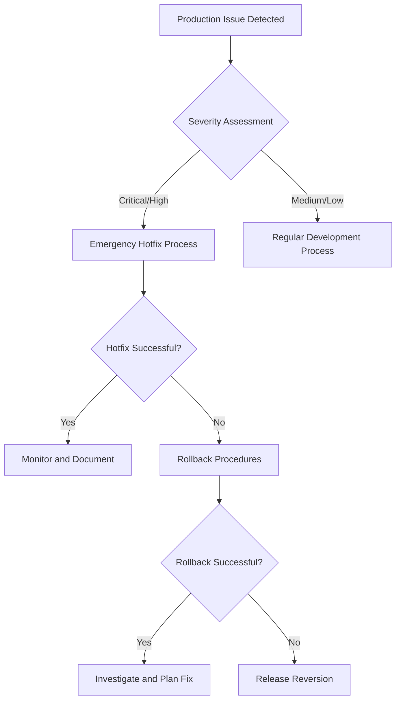

# Hotfix Guide

This guide covers emergency procedures for critical production issues, including hotfixes, rollbacks, and release reversions.

## 📋 Table of Contents

- [Emergency Procedures Overview](#emergency-procedures-overview)
- [Hotfix Workflow](#hotfix-workflow)
- [Rollback Procedures](#rollback-procedures)
- [Release Reversion](#release-reversion)
- [Best Practices](#best-practices)
- [Communication Protocols](#communication-protocols)

## 🚨 Emergency Procedures Overview

### When to Use Emergency Procedures

| Severity     | Situation                                   | Procedure                    |
| ------------ | ------------------------------------------- | ---------------------------- |
| **Critical** | Production down, data loss, security breach | Hotfix + Immediate deploy    |
| **High**     | Major feature broken, performance degraded  | Hotfix within 2-4 hours      |
| **Medium**   | Minor bugs affecting users                  | Regular development workflow |

### Decision Tree


## 🔥 Hotfix Workflow

### Step 1: Create Critical Issue

1. **Create GitHub Issue** with clear description:
   ```markdown
   Title: [CRITICAL] Payment gateway timeout causing checkout failures

   **Severity**: Critical
   **Impact**: 100% checkout failures, revenue loss
   **Discovery**: Customer reports + monitoring alerts
   **Timeline**: Started ~2 hours ago

   **Symptoms**:
   - All payment attempts timing out after 30 seconds
   - Error logs showing gateway connection failures
   - 500+ customer complaints

   **Business Impact**:
   - Estimated $10k/hour revenue loss
   - Customer satisfaction impact
   - Potential regulatory issues
   ```

2. **Add label**: `critical`
3. **Assign**: Senior developer + on-call engineer
4. **Notify**: Stakeholders via emergency communication channels

### Step 2: Add to Sprint Board

1. Add critical issue to Sprint Board
2. Set **Priority**: High
3. Set **Estimate**: (rough estimate acceptable for urgent fixes)
4. Move to **"In Progress"** immediately
5. **Notify team**: Via Slack/Teams emergency channel

### Step 3: Create Hotfix Branch

**Important**: Hotfix branches come from `main`, not `develop`

1. Navigate to the critical issue
2. Click "Create a branch for this issue"
3. **Critical**: Set source branch to `main` (not `develop`)
4. GitHub creates branch like: `123-fix-critical-payment-gateway-timeout`

```bash
# Verify you're on the right branch
git checkout 123-fix-critical-payment-gateway-timeout
git log --oneline -1  # Should show latest commit from main
```

### Step 4: Implement Emergency Fix

```bash
# Work on auto-generated issue branch
git checkout 123-fix-critical-payment-gateway-timeout
git pull origin 123-fix-critical-payment-gateway-timeout

# Make focused changes - keep scope minimal
git add .
git commit -m "fix(payment): increase gateway timeout to 60s"

# Test thoroughly but quickly
# Add additional commits if needed
git commit -m "fix(payment): add retry logic for failed connections"
git commit -m "fix(payment): improve error handling for timeout scenarios"

# Push the branch
git push origin 123-fix-critical-payment-gateway-timeout
```

### Step 5: Emergency PR Process

1. **Create PR to main** (not develop)
2. **Request immediate review** from senior team member
3. **Expedite CI/CD** - monitor pipeline closely
4. **Document the fix** in PR description

**Emergency PR Template:**
```markdown
## CRITICAL HOTFIX: Payment Gateway Timeout

### Issue
- Resolves: #123
- Severity: Critical - Production Down
- Impact: 100% payment failures since 14:00 UTC

### Root Cause
Gateway timeout increased from 30s to 60s due to provider infrastructure issues

### Solution
- Increased timeout configuration from 30s to 60s
- Added retry logic for temporary failures
- Improved error handling and logging

### Testing
- [x] Local testing with simulated timeouts
- [x] Staging environment validation
- [x] Monitoring alerts configured

### Deployment Plan
- [x] Merge to main immediately
- [x] Automated deployment to production
- [x] Monitor for 30 minutes post-deploy
- [x] Customer communication prepared

### Rollback Plan
If issues persist:
1. Revert this PR
2. Scale up payment processing instances
3. Switch to backup payment provider
```

### Step 6: Deploy and Monitor

```bash
# After PR is merged to main
# Automated deployment should trigger
# Monitor closely:

# Check deployment status
# Monitor error rates
# Watch business metrics
# Verify customer reports decrease
```

### Step 7: Sync to Develop

**Critical**: After hotfix is deployed and stable, sync to develop:

```bash
git checkout develop
git pull origin develop
git merge origin/main --no-ff
git push origin develop
```

### Step 8: Post-Incident Activities

```
□ Update incident status (resolved)
□ Communicate fix to stakeholders
□ Document lessons learned
□ Schedule post-mortem meeting
□ Update monitoring/alerting
□ Create follow-up issues for improvements
```

## 🔄 Rollback Procedures

When a hotfix causes additional problems or fails to resolve the issue:

### Method 1: Revert Hotfix (Recommended)

**When to use**: The hotfix is causing new problems or didn't fix the original issue.

```bash
# 1. Create new critical issue for rollback
# Title: [CRITICAL] Rollback payment gateway timeout fix

# 2. Create branch from main
git checkout main
git pull origin main

# 3. Create rollback branch (from new issue)
git checkout 456-rollback-payment-gateway-fix

# 4. Identify the problematic commit
git log --oneline main -5
# Output: a1b2c3d fix(payment): increase gateway timeout to 60s

# 5. Revert the problematic commit
git revert a1b2c3d

# 6. Push and create emergency PR to main
git push origin 456-rollback-payment-gateway-fix
```

### Method 2: Partial Rollback

**When to use**: Only part of the hotfix is problematic.

```bash
# Create new branch for partial rollback
git checkout 789-partial-rollback-payment-fix

# Revert specific files or changes
git checkout HEAD~1 -- src/payment/timeout-config.js
git commit -m "fix(payment): revert timeout changes, keep retry logic"

git push origin 789-partial-rollback-payment-fix
```

### Method 3: Forward Fix

**When to use**: The root cause is understood and a quick fix is available.

```bash
# Create new critical issue for forward fix
# Create branch and implement proper solution
git checkout 101-fix-payment-gateway-properly

# Implement the correct fix
git commit -m "fix(payment): properly configure gateway connection pool"
git push origin 101-fix-payment-gateway-properly
```

## 🚨 Release Reversion

When hotfixes cannot resolve the issue and the entire release needs to be reverted:

### Step 1: Assess Reversion Scope

```bash
# Identify what needs to be reverted
git log --oneline main -20

# Check what changed in the problematic release
git diff v1.1.0..v1.2.0 --name-only
```

### Step 2: Create Release Reversion Issue

```markdown
Title: [CRITICAL] Revert Release v1.2.0 due to payment system failures

**Severity**: Critical
**Decision**: Revert entire v1.2.0 release
**Reason**: Multiple payment-related issues, hotfixes ineffective
**Target**: Return to v1.1.0 stable state

**Reversion Plan**:
1. Revert main branch to v1.1.0
2. Keep develop branch unchanged
3. Create new release v1.2.1 with reversion
4. Plan proper fix for v1.3.0
```

### Step 3: Execute Release Reversion

```bash
# 1. Create reversion branch from main
git checkout main
git pull origin main
git checkout -b 999-revert-release-v1.2.0

# 2. Revert to previous stable release
git revert --mainline 1 <merge-commit-hash-of-v1.2.0>

# 3. Create emergency PR
git push origin 999-revert-release-v1.2.0
```

### Step 4: Handle Develop Branch

**Critical**: DO NOT revert develop branch. Instead:

```bash
# Keep develop unchanged - it contains fixes for next release
# Create new branch for proper fixes
git checkout develop
git checkout -b fix-payment-issues-for-v1.3.0

# Implement proper fixes
git commit -m "fix(payment): comprehensive payment gateway refactor"
```

### Step 5: Communication Plan

```markdown
**Immediate Communication** (within 15 minutes):
- Technical team via Slack/Teams
- Management via emergency escalation
- Customer support with holding response

**Short-term Communication** (within 1 hour):
- Customer notification (if required)
- Status page update
- Stakeholder briefing

**Follow-up Communication** (within 24 hours):
- Post-mortem scheduling
- Detailed incident report
- Process improvement plans
```

## 🎯 Best Practices

### Prevention
```
□ Comprehensive testing before releases
□ Feature flags for risky changes
□ Gradual rollout strategies
□ Robust monitoring and alerting
□ Load testing under realistic conditions
```

### During Emergency
```
□ Stay calm and follow procedures
□ Document everything in real-time
□ Communicate proactively
□ Focus on minimal scope fixes
□ Test rollback procedures before using them
```

### After Resolution
```
□ Conduct blameless post-mortem
□ Update documentation and procedures
□ Improve monitoring and alerting
□ Plan preventive measures
□ Share learnings with team
```

## 📞 Communication Protocols

### Emergency Escalation Chain

1. **L1 Response** (0-15 minutes)
   - On-call engineer
   - Senior developer
   - Team lead

2. **L2 Escalation** (15-60 minutes)
   - Engineering manager
   - Product manager
   - CTO (if critical)

3. **L3 Executive** (60+ minutes)
   - CEO notification
   - Customer communication
   - PR/Legal (if required)

### Communication Templates

**Slack Emergency Alert:**
```
🚨 CRITICAL PRODUCTION ISSUE 🚨
Issue: Payment gateway timeout causing 100% checkout failures
Impact: Revenue loss ~$10k/hour
Action: Hotfix in progress, ETA 2 hours
Incident Lead: @john.doe
Status Updates: Every 30 minutes
```

**Customer Communication:**
```
Subject: Service Disruption - Payment Processing [RESOLVED]

We are currently experiencing issues with payment processing that may affect your ability to complete purchases. Our engineering team is actively working on a resolution.

Expected Resolution: Within 2 hours
Workaround: Please try again in 1 hour

We apologize for any inconvenience and will provide updates as they become available.
```

## 🔧 Tools and Scripts

### Useful Commands

```bash
# Quick health check
curl -s https://api.yoursite.com/health | jq '.'

# Check recent error logs
kubectl logs -n production --tail=100 payment-service

# Monitor deployment status
kubectl rollout status deployment/payment-service -n production

# Quick rollback (if using Kubernetes)
kubectl rollout undo deployment/payment-service -n production
```

### Monitoring Queries

```bash
# Error rate spike detection
error_rate_5m > 0.05

# Response time degradation
response_time_p95 > 2000

# Payment failures
payment_failure_rate > 0.01
```

## 🎯 Quick Reference

### Hotfix Checklist:
```
□ Create critical issue with 'critical' label
□ Add to Sprint Board with High priority
□ Create branch from main (not develop)
□ Implement minimal scope fix
□ Get expedited review
□ Merge to main and deploy
□ Monitor for 30+ minutes
□ Sync to develop
□ Document lessons learned
```

### Rollback Decision Tree:
```
Hotfix failed? → Try rollback
Rollback failed? → Try release reversion
Reversion failed? → Emergency escalation
All else failed? → Activate disaster recovery
```

### Emergency Contacts:
```
On-call Engineer: [Slack @oncall]
Emergency Escalation: [Manager contact]
Customer Support: [Support team channel]
Infrastructure Team: [Infra team channel]
```

---

**Related Guides**:
- [Contributing Guidelines](../CONTRIBUTING.md) - Standard development workflow
- [Release Process](RELEASE_PROCESS.md) - Regular release procedures