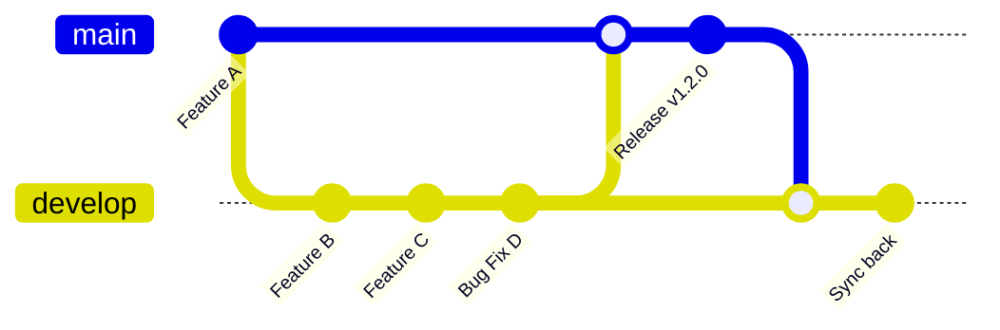

# Release Process Guide

This guide covers the complete release workflow for deploying from `develop` to `main` and managing automated releases via Release Please.

## 📋 Table of Contents

- [Release Overview](#release-overview)
- [Pre-Release Checklist](#pre-release-checklist)
- [Release Workflow](#release-workflow)
- [Milestone Management](#milestone-management)
- [Post-Release Tasks](#post-release-tasks)
- [Troubleshooting](#troubleshooting)

## 🚀 Release Overview

We use **Release Please** to automate versioning, changelog generation, and GitHub Releases based on [Conventional Commits](https://www.conventionalcommits.org/).

### Release Flow


### Key Principles
- **`main`** is the production/release branch
- **`develop`** contains integrated features ready for next release
- **Release Please** automatically handles versioning and changelogs
- **Milestones** track what goes into each release

## ✅ Pre-Release Checklist

Before initiating a release, the **develop branch owner** (usually project lead or release manager) must verify:

### 1. Milestone Completion
```
□ All issues in target milestone are resolved
□ All associated PRs are merged to develop
□ No open issues blocking the release
□ Milestone is marked as complete
```

### 2. Branch Status Verification
```
□ All feature branches for this release are merged
□ No unintended branches accidentally merged
□ develop branch is stable and tested
□ CI/CD pipeline passes on develop
```

### 3. Quality Gates
```
□ All automated tests passing
□ Code coverage meets requirements (80%+)
□ Security scans completed
□ Performance benchmarks acceptable
```

### 4. Documentation
```
□ API documentation updated
□ User-facing documentation current
□ Migration guides prepared (if needed)
□ Known issues documented
```

## 🔄 Release Workflow

### Step 1: Verify Milestone Readiness

Check the target milestone (e.g., `v1.2.0`):

```bash
# Review milestone status
# Go to GitHub → Issues → Milestones
# Verify all issues are closed and PRs merged
```

**Common milestone issues to resolve:**
- **Unmerged PRs**: Ensure all feature branches are merged to develop
- **Scope creep**: Move non-essential items to next milestone
- **Blocking issues**: Resolve critical bugs before release
- **Accidental inclusions**: Remove unrelated branches that got merged

### Step 2: Clean Up develop Branch

Remove any unintended changes:

```bash
# Check what's in develop that wasn't planned
git log --oneline main..develop

# If there are unintended commits, create a cleanup branch
git checkout develop
git checkout -b cleanup-pre-release
git revert <unintended-commit-hash>
git push origin cleanup-pre-release

# Create PR to develop to remove unintended changes
```

### Step 3: Create Release PR

Create a PR from `develop` to `main`:

```bash
# Ensure develop branch is up to date
git checkout develop
git pull origin develop

# Create release PR
# Title: "Release v1.2.0 - [Milestone Name]"
# Description template:
```

**PR Template:**
```markdown
## Release: v1.2.0 - [Milestone Name]

### Summary
This PR merges the latest changes from `develop` to `main` to initiate the automated release process.

### Milestone: [Link to milestone]
- [ ] All milestone issues resolved
- [ ] All PRs merged to develop
- [ ] CI/CD pipeline passing
- [ ] Documentation updated

### Changes in this Release
<!-- Auto-generated or manually list key features -->
- feat(auth): Add OAuth2 integration
- fix(ui): Resolve mobile responsive issues
- feat(api): New user management endpoints

### Pre-Release Checklist
- [ ] Milestone 100% complete
- [ ] All tests passing
- [ ] Documentation current
- [ ] Security scan clean
- [ ] Performance acceptable

### Post-Merge Actions
- [ ] Monitor Release Please PR creation
- [ ] Review automated changelog
- [ ] Merge Release Please PR
- [ ] Sync main back to develop
```

### Step 4: Review and Merge Release PR

1. **Team review**: Get approval from team leads
2. **Final testing**: Run any manual tests if needed
3. **Merge to main**: This triggers Release Please automation

### Step 5: Handle Release Please PR

After merging to main, Release Please will automatically:

1. **Create Release PR**: `chore(main): release v1.2.0`
2. **Generate changelog**: Based on conventional commits
3. **Calculate version**: Using semantic versioning rules

**Review the Release Please PR:**
```
□ Version number is correct
□ Changelog entries are accurate
□ No sensitive information exposed
□ Breaking changes properly documented
```

### Step 6: Finalize Release

Merge the Release Please PR to complete the release:

1. **Merge Release Please PR** → Creates git tag and GitHub release
2. **Automated deployment** triggers (if configured)
3. **Release notes** published automatically

### Step 7: Sync Back to develop

**Critical**: Sync changes back to develop:

```bash
git checkout develop
git pull origin main --no-ff
git push origin develop
```

This ensures develop has:
- Updated version numbers
- Latest CHANGELOG.md
- Any release-specific commits

## 📊 Milestone Management

### Creating Milestones

For each release, create a milestone:

```
Title: v1.2.0 - Authentication & Mobile Improvements
Due Date: 2025-07-15
Description:
- OAuth2 integration
- Mobile responsive fixes
- User management API
- Security enhancements
```

### Milestone Hygiene

**During development:**
- Assign issues to appropriate milestones
- Move issues between milestones as priorities change
- Close completed milestones promptly

**Before release:**
- Review milestone completion (should be 100%)
- Move incomplete items to next milestone
- Document any scope changes

### Milestone Reports

Generate milestone reports for stakeholders:
```bash
# Example metrics to track:
- Issues planned vs completed
- Story points estimated vs actual
- Timeline adherence
- Quality metrics (bugs found, test coverage)
```

## 🔧 Post-Release Tasks

### Immediate Actions (within 1 hour)
```
□ Monitor deployment status
□ Verify application health checks
□ Check error rates and performance
□ Sync main back to develop
□ Update internal documentation
```

### Short-term Actions (within 24 hours)
```
□ Communicate release to stakeholders
□ Update user documentation
□ Monitor user feedback
□ Address any critical issues
□ Plan next milestone
```

### Medium-term Actions (within 1 week)
```
□ Analyze release metrics
□ Conduct release retrospective
□ Update process documentation
□ Archive completed milestone
□ Begin next sprint planning
```

## 🚨 Troubleshooting

### Release Please Issues

**Problem**: Release Please creates wrong version number
```bash
# Solution: Usually due to incorrect commit formats
# Review recent commits for conventional commit compliance
git log --oneline main -10

# Edit the Release Please PR before merging
# Or create manual adjustment commit
```

**Problem**: Missing changelog entries
```bash
# Cause: Commits don't follow conventional format
# Solution: Manually edit CHANGELOG.md in Release Please PR
```

### Milestone Issues

**Problem**: Milestone not 100% complete at release time
```bash
# Options:
1. Delay release until complete
2. Move incomplete items to next milestone
3. Create patch release for critical items
```

**Problem**: Unplanned changes in develop
```bash
# Identify unplanned changes
git log --oneline main..develop

# Options:
1. Revert unplanned commits
2. Fast-track through review process
3. Move to next release
```

### Deployment Issues

**Problem**: Release deployment fails
```bash
# Immediate actions:
1. Check CI/CD pipeline logs
2. Verify environment health
3. Consider rollback if critical
4. Document issue for post-mortem
```

**Problem**: Critical bug found after release
```bash
# Follow hotfix process:
# See docs/HOTFIX_GUIDE.md for detailed procedures
```

## 📈 Release Metrics

Track these metrics for continuous improvement:

### Quality Metrics
- Bug escape rate (bugs found in production)
- Test coverage percentage
- Time to resolve production issues
- Customer satisfaction scores

### Process Metrics
- Release frequency
- Lead time (feature to production)
- Deployment success rate
- Rollback frequency

### Planning Metrics
- Milestone completion rate
- Scope creep percentage
- Estimation accuracy
- Velocity trends

## 🎯 Quick Reference

### Standard Release Workflow:
```
1. Verify milestone completion (100%)
2. Clean up develop branch if needed
3. Create PR: develop → main
4. Review and merge release PR
5. Review Release Please automated PR
6. Merge Release Please PR (creates release)
7. Sync main back to develop
8. Monitor deployment and metrics
```

### Emergency Release Commands:
```bash
# Check what's ready for release
git log --oneline main..develop

# Create release branch (if needed)
git checkout -b release/v1.2.0 develop

# Sync back after release
git checkout develop
git pull origin main --no-ff
git push origin develop
```

### Milestone Commands:
```bash
# List milestones (via GitHub CLI)
gh issue list --milestone="v1.2.0"

# Check milestone completion
gh issue list --milestone="v1.2.0" --state=open
```

---

**Next Steps**: After reading this guide, see [HOTFIX_GUIDE.md](HOTFIX_GUIDE.md) for emergency procedures.